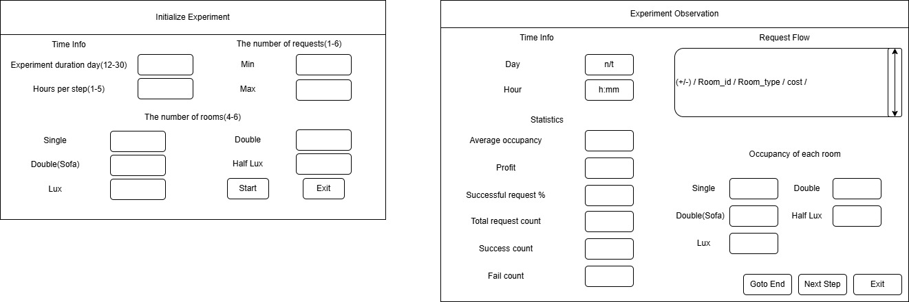

# HotelReservation

Задача — разработать симуляционную программу для моделирования системы поддержки
бронирования и заселения гостиницы:
1. На каждом шаге симуляции поступает случайное количество запросов.
2. Каждый запрос содержит информацию о типе номера, который гость желает
забронировать, и дату проживания.
3. Если запрашиваемый номер доступен, он бронируется на указанный период.
4. Если запрашиваемого номера нет, система автоматически предлагает номер более
высокого класса.
5. На каждом шаге рассчитываются статистические показатели, такие как уровень
заполняемости и прибыль.
6. Графический интерфейс отображает обработку запросов и статистику работы системы.

## UML Diagram(MVC architecture pattern)

## Object Diagram

## App GUI

## Used pattern
1. Creational Patterns
    - Simple Factory (or Factory Method) Pattern
    - Object Composition in Initialization
2. Structural Patterns
    - Model–View–Controller (MVC) Pattern
    - Composite and Facade-like Structures in the GUI
3. Behavioral Patterns
    - Command Pattern
    - Mediator-like Coordination